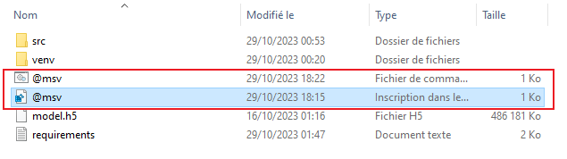
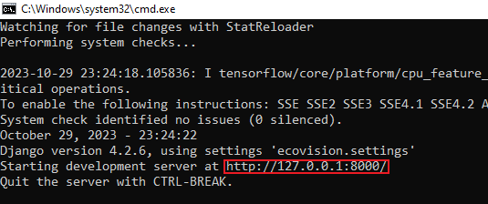

# README - Interface de Prédiction pour le Challenge PAS : Forest Innovation

Bienvenue à l'interface de visualisation des prédictions de notre modèle d'IA pour le Challenge PAS : Forest Innovation. Cette interface, développée avec Django, vous permet de visualiser facilement les résultats de notre modèle. Suivez ces instructions pour télécharger, configurer et utiliser l'interface.

## Téléchargement de l'Interface

Pour obtenir l'interface, suivez ces étapes simples :

1. Ouvrir ce [lien](https://www.dropbox.com/scl/fi/msazmfv73z3xac1qz5qj4/EcoVisionSN.zip?rlkey=wetwv810xh39xo0puklqi5kia&dl=0) avec votre navigateur vous redirigera vers la plateforme d'hébergement.
2. Téléchargez l'archive au format ZIP contenant l'application.

## Configuration de l'Interface

Une fois l'archive téléchargée, procédez comme suit pour configurer l'interface :

1. Décompressez l'archive ZIP.
2. Ouvrez le dossier résultant.

À l'intérieur de ce dossier, vous trouverez deux fichiers importants :

- `@msv.reg`: Exécutez ce fichier une seule fois. Il configure des paramètres spécifiques nécessaires au bon fonctionnement de l'interface.

- `@msv.bat`: Pour démarrer le serveur local et accéder à l'interface, il vous suffit de double-cliquer sur ce fichier. Notez que l'exécution de ces fichiers peut générer un avertissement de sécurité de la part de Windows, mais il n'y a aucun risque. Une fois le fichier `@msv.bat` exécuté, les bibliothèques nécessaires au modèle seront automatiquement téléchargées. Le processus prend généralement 5 minutes, mais cela peut être plus long en cas de connexion Internet lente. Une fois le serveur démarré, un lien local ressemblant à `localhost:127.0.0.1:####` s'affichera (les `#` représentent le numéro de port, qui peut varier d'une exécution à l'autre).

## Visualisation de l'Interface

Pour accéder à l'interface, suivez ces étapes :

1. Copiez le lien `127.0.0.1` dans la barre d'adresse de votre navigateur.
2. Ajoutez `/index` à la fin du lien, puis appuyez sur Entrée.

## Aperçu de l'Interface

Une fois connecté, vous verrez une interface similaire à l'image ci-dessous :

## Utilisation de l'Interface

1. Cliquez sur le bouton "Tester la solution" pour commencer.

2. Vous serez redirigé vers une seconde page où vous devrez télécharger une image au format PNG de 512x512 pixels, représentant une zone forestière vue par satellite ou drone/aérien. Cela est crucial, car le non-respect des conditions, telles que la dimension de l'image ou le format, peut entraîner des erreurs ou un dysfonctionnement du modèle.

3. Une fois l'image chargée, cliquez sur le bouton "Upload" et attendez environ 15 secondes.

4. Vous serez dirigé vers une page affichant les prédictions du modèle.

C'est tout ! Vous êtes maintenant prêt à utiliser notre interface de prédiction pour le Challenge PAS : Forest Innovation. N'hésitez pas à nous contacter si vous avez des questions ou rencontrez des problèmes.
**Mail** : Ecovisionsn@gmail.com

---
